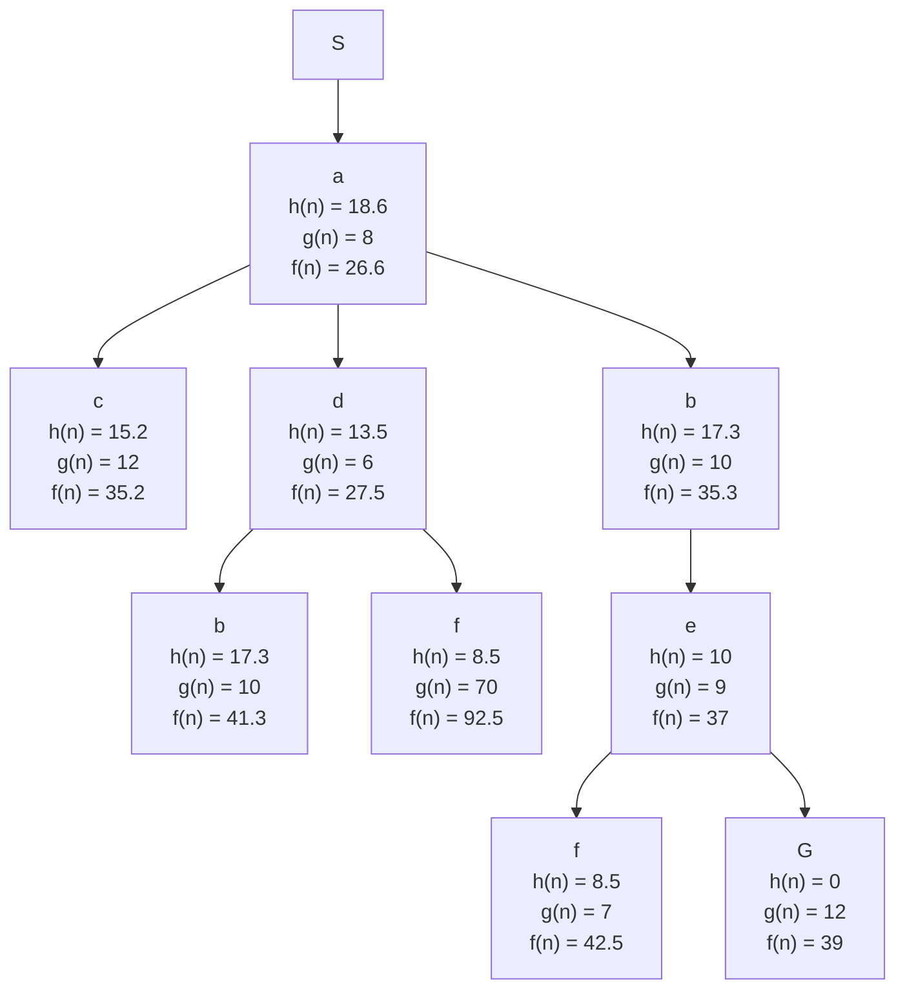

- ##### Describe the four categories or approaches for study AI as summarized by the authors in Chapter 1: think like, act like, … Know the approach they take throughout the book and be able to give their definition.
	- ###### Think like humans
		- *If the program's input-output behavior matches corresponding human behavior, that is evidence that some of the program's mechanisms could also be operating in humans*
	- ###### Act like humans
		- *To act humanly a program would need:*
			- *natural language processing or the ability to communication successfully in a human language*
			- *Knowledge representation or the ability to store what it knows or hears*
			- *automated reasoning or the ability to answer questions and to draw new conclusions*
			- *Machine learning or the ability to adapt to new circumstances and to detect and extrapolate patterns*
	- ###### Think rationally
		- 
	- ###### Act rationally
		- *Uses a rational agent and acts in order to achieve the best possible outcome or, when there is uncertainty, the best expected outcome.*
- ##### Define and contrast the terms Rational Function and Rational Agent
	- *An agent is an entity that perceives and acts and a rational agent is one that acts so as to achieve the best outcome or, when there is uncertainty, the best expected outcome.*
- ##### Be able to apply the PEAS model, define/describe the acronym terms and be able to describe an environment and choose what properties the environment has.
	- ###### PEAS
		- *Performance measure*
		- *Environment*
		- *Actuators*
		- *Sensors*
	- ###### Environment Types
		- ###### Fully observable
			- *An agent's sensors give it acces to the complete state of the environment at each point in time*
			- *Partially observable implies the opposite*
		- ###### Deterministic
			- *The next state of the environment is completely determined by the current state and the action executed by the agent*
			- Stochastic
		- ###### Episodic
			- The agent's experience is divided into atomic "episodes" (each episode consists of the agent perceiving and then performing a single action), and the choice of action in each episode depends only on the episode itself.
			- Sequential
		- ###### Static
			- *The environment is unchanged while an agent is deliberating.*
			- The dynamic
		- ###### Discrete
			- *A limited number of distinct, clearly defined percepts and actions*
		- ###### Single agent
			- *An agent operating by itself in an environment*
- ##### Know the attributes used for analyzing and measuring performance of uninformed and informed search algorithms. Completeness, Optimality, Time-Complexity, and Space Complexity. Be able to describe for BFS or DFS.
	- ###### Completeness
		- *Does it always find a solution if one exists?*
	- ###### Optimality
		- *Does it always find a least-cost solution*
	- ###### Time-Complexity
		- *Number of nodes generated/expanded*
	- ###### Space Complexity
		- *Maximum number of nodes in memory*
	- ###### DFS
		- **Completeness:** Not complete, fails in infinite-depth spaces, spaces with loops. Complete in finite spaces
		- **Time Complexity:** $O(b^m)$  terrible if m is much larger than d but if solutions are dense, may be much faster than breadth-first
		- **Space Complexity:** $O(bm)$ linear space
		- **Optimality:**  No
	- ###### BFS
		- **Completeness:** Yes (if b is finite)
		- **Time Complexity:**  $O(b^{d+1})$
		- **Space Complexity:** $O(b^{d+1})$ (keeps every node in memory)
		- **Optimality:** Yes (if cost = 1 per step); not optimal in general
- ##### For a heuristic function, h(n), know what an admissible h(n) means and what a consistent (or monotonic) h(n) means (definitions below). 
	- *An admissible h(n) means it underestimates the cost of getting from node n to goal*
	- *A consistent or monotone function h means that for all states a and b, where b is a (possibly indirect) descendant of a, and a is the action to go from a to b, h(a) <= cost(a, b) + h(b), where cost(a, b) is the actual cost (in number of moves) of going from state a to b*
- ##### Be able to apply this knowledge to a problem. Identify admissible and consistent heuristics. Know what makes one heuristic function more informed than another; describe formally. Know what is means by one heuristic dominating another
	- A heuristic is admissible when h(n) $\leq$ h*(n) where h*(n) is the true cost from n.
	- A heuristic is consistent when h(n) $\le$ c(n, a, n') + h(n') or f(n) is nondecreasing along any path
	- A heuristic dominates another when it is better for search and means that $h_2(n) \ge h_1(n)$ for all n(both admissible). $h_2$ dominates $h_1$ 

#### Applied Ones

- ##### For informed search algorithms, be able to apply the evaluation function f(n)=g(n) + h(n) to search algorithms and know the meanings and uses of g(n) and h(n).
- ##### Be able to give a problem formulation in terms of describing the states, actions, transition model, start state, path costs, and goal state test. Using tree-search and/or graph-search, be able to show a search tree and/or a trace of node generation using BFS, DFS, Uniform cost search, (greedy) Best First search and/or A* search. Know the relationship between these.
	- 
- **State**
	- *A representation of a physical configuration*
- **Node**
	- *A data structure constituting part of a search tree. Includes parent, children, depth, path cost g(x)*
- **Percepts**
	- *A percept refers to the agent's perceptual inputs at any given instance*
- **Actions**
	- 
- **Sensors**
	- 
- **Agent**
	- *Anything that can be viewed as perceiving its environment through sensors and acting upon that environment through actuators*

- **Best-first Search**
	- Use an evaluation function for each node ie. an estimate of desirability
	- Expand most desirable unexpanded node
- **Greedy Search**
	- Special case of Best-first search
	- Expands the node that appears to be closest to goal![[Pasted image 20220316165524.png]]
- **A* Search**
	- *Avoid expanding paths that are already expensive*
	- *f(n) = g(n) + h(n)*
	- *f(n) = estimated total cost of path through n to goal*
	- *h(n) = estimated cost to goal from n*
	- *g(n) = cost so far to reach n*

**Agent Types**
- Simple reflex agents
	- Takes input from environment into sensors, asks what the world is like now, and what action to take based on this. The actions are determined by condition-action rules and then the actuators act upon this![[Pasted image 20220316175156.png]]
- Model-based reflex agents![[Pasted image 20220316175359.png]]
- Goal-based agents![[Pasted image 20220316175411.png]]
- Utility-based agents![[Pasted image 20220316175424.png]]

![[20220316_204658.jpg]]

Closed List = Sacd
Path = S->a->b->e->G
Final cost = 39
