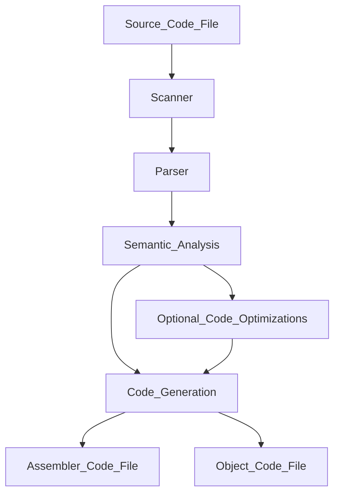

## Types of Problems:
- Short Answer
- Derive a REGEX, FSA, or Grammar for a language
- Derive a language from FSA, Grammar, or REGEX
- Apply definitions covered in topcis below
- Classify grammars in Chomsky Hierarchy
- Apply set theory operations for reasoning about languages

## Topics
- #### Be able to define and/or explain the concepts of compiler, interpreter, hybrid compiler-interpreter, linkers, virtual machines, source code, object code, target code, executable code, static library; know how these terms are related and be ready to give examples of languages and their development environments
	- **Compiler**:
		- *A translator that translates the source code into code expressed in another language called Target Code.* 
		- *Generate very low-level code for the most part*
		- *Is a problem itself and must be written in a language*
		- *Can have multiple target languages assigned to one source code*


- Object code to executable
	```mermaid
		flowchart TD;
		subgraph Library;
			Machine_Object_Code_1; Machine_Object_Code_2;
		end;
			Library --> Linker
			Source_Code_Language_A --> Compiler_A --> Object_Code_1_Machine_M --> Linker;
			Source_Code_Language_B --> Compiler_B --> Object_Code_2_Machine_M --> Linker;
			Linker --> Executable --> m["MicroCode | Physical Machine M"];		
	```
	
	- 
		- **Cross-compilers**:
			- *Compilers that generate code for a machine that is not the same as the current machine being worked on ie. $M_1$ $\neq$ $M_2$* 
		- **Interpreter**:
			- Also includes a scanner and a parser.
			- The input language is not translated to a language external to the interpreter code.
			- An AST is generated to emulate semantics of the construct.
			- Often implemented in a Read-Evaluate-Print-Loop (REPL) environment. Bash or Powershell operate this way.
			- Code execution often slower than compilation.
	```mermaid
	flowchart TD;
		int["Interpreter | internal compiler and abstract machine"]
		sc[(source code)] --> int
		in[(input)] --> int
		int --> ot[(output)]
	```
	
	- **Hybrid compiler-interpreter**
		- Target code resembles that of compilers but is instead interpretetd by a virtual machine.
		- Target code is called byte-code and the most widely-used language with such a scheme is Java.
		- Java's byte code is interpreted by the Java virtual machine or JVM.
		- Python also has a similar build process as Java and uses the Python Virtual Machine as well as it's own associated byte-code.
		```mermaid
			flowchart TD;
				java["
				1. Load bytecode files
				2. Byte code verification
				3. Recursively linke additional, necessary byte code files
				4. Additional checks and initialization
				5. Interpreter executes"]
	
				src1["Java | Source Code 1"];
				src2["Java | Source Code 2"];
				src1 --> Java_Compiler_1 --> Byte_Code_1 --> java;
				src2 --> Java_Compiler_2 --> Byte_Code_2 --> java;
				java --> id1["Microcode | Physical Machine M"]
				
		```
		
	- **Linker**
		- Used to resolve object files with unresolved operand addresses.
		- The final phase of building a program
	- **Virtual machine**
		- Abstract software-based machine that interptrets target code generated by hybrid compiler-interpreter
	- **Source code**
		- *Code that is to be translated*
	- **Object code**
		- *Stored in object files*
		- *Target code for a machine that has unresolved operand addresses (such as location of function calls)*
	- **Target code**
		- *The code that has been translated from another source code. Can be expressed in another language compared to the source code. The language of the target code is called the target language* 
	- **Executable code**
	- **Static library**
- #### Know the major phases and data structures/models used in compilers:
	- **Lexical analysis/scanner: (token stream)**
		- *Involves reading the source code character by character, eliminating whitespace (space, tab, newline characters), removing comments and recognizing lexemes.*
		- A lexical error occurs when a character does not match the proper pattern of an accepted lexeme such as the @ sign.
	- **Parser/syntax analyzer/parse: parse tree**
		- *Parser analyzes grammatical structure of source code and, if syntax is correct, produces a parse tree representation of syntactical structure.*
		-  A syntax error occurs when when something that goes against the rules or syntax of the language occurs such as mispelling a reserved word like int as nit
	- **Semantic analyzer and intermediate code generation: abstract syntax tree**
		- *AST produced by syntax analysis is traversed.*
		- 
	- **Machine independent code optimization (optional): (e.g. 3-address instructions)**
	- **Code generator target code generator (e.g. assembler)**
	- **Modified target code generator**
		- *Always M1* 
- #### Know how the Simple_PL1 scanner is designed and how tokens and lexemes are represented and communicated to the parser. Know the difference between a lexeme and a token.
	- **Lexeme**
		- *Lexemes are meaningful strings that are treated as "atomic" in a language like `sum`, `<=`, or `for`*
	- **Token**
		- For each lexeme, a token is produced by scanner. Each token has the form token_name
- #### Know definitions related to Chomsky grammars, such as definitions of the terms: Kleene closure, languages, productions, derives, sentential forms, sentences, non-terminals, terminals
	- **Kleene closure**
		- 
	- **Languages**
		- *A language, L(G), generated by a grammar G, is defined as the set of sentences:* $$L(G) = {a\in V_T^* | S \implies^+ \alpha}$$
	- **Productions**
		- *Not derivations, denoted with the $\to$ symbol to show the base cases for which a grammar can produce. Ex;*
			- *Assume grammar with following productions:*
				>S $\to$ AB
				A $\to$ a
				B $\to$ b
			- *A $\to$ a is a production just as B $\to$ b is one* 
	- **Derives**
		- *If $\alpha \to \beta$ is a production and $\omega \alpha \phi$ is a string where $\omega, \phi \in V^*$ and $\alpha \in V^+$, then $\omega \alpha \phi \implies \omega \beta \phi$ is an immediate or direct derivation*
			- *Denoted with $\implies$ symbol, not production, shows the derived cases from a production*
			- *Assume the following grammar:*
			> S $\to$ AB
		    A $\to$ a
		    B $\to$ b
		    - *We could show a derivation as follows:* $$S\implies AB \implies aB \implies ab$$
				- *Or:* $$S \implies AB \implies Ab \implies ab$$
				- *Both are valid derivations*
	- **Sentential forms**
		- *A string $\alpha$ derivable from the start symbol, S*
	- **Sentences**
		- A derivation of a grammar in sentential form
	- **Non-terminals**
		- *$V_N$ is the nonempty finite set of symbols called non-terminals*
		- *In our cases, non-terminals have been lowercase, or non-uppercase letters*
	- **Terminals**
		- *$V_T$ is the nonempty finite set of symbols called terminals where $V_N \cap V_T = \emptyset$*
		- *In our cases, terminals have been upper-case letters*
- #### Be able to classify the most restrictive grammar class according to the form of production rules.
	- **Phrase-Structured Grammar (type 0):**
		- *Productions of the form $\alpha \to \beta$* 
		- *Where $\alpha \in V^+$ and $\beta \in V^*$.*
		- *Also known as unrestricted*
		- Example of Phrase-Structured Grammar:
			- ![[Pasted image 20220313010612.png]]
			- There are multiple symbols on the left side for the production abSc $\to$ abbAcc therefore the grammar cannot be Regular or Context-Free. The production bA $\to$ b has |$\beta$| < |$\alpha$| therefore it cannot be Context-Sensitive which leaves the only option being Phrase-Structure Grammar
	- **Context-Sensitive Grammar (type 1):**
		- Productions of the form $\alpha \to \beta$ where $\alpha \in V^+, \alpha \neq \beta, and |\beta| \geq |\alpha|$
		- Example of Context-Sensitive Grammar:
			- ![[Pasted image 20220313011225.png]]
			- There are 2 symbols on the left with the productions cE $\to$ cdS | cd therefore the grammar cannot be Context-Free or Regular.
	- **Context-Free Grammar (type 2):**
		- Productions of the form: $A \to \beta$ where $A \in V_N$ and $\beta \in V^+$.
		- Example of Context-Free Grammar:
			- ![[Pasted image 20220313011709.png]]
			- The production S $\to$ aSb does not follow the form of either a right linear or left linear grammar thefore the grammar cannot be Regular.
			- S $\in$ $V_N$, aSb $\in$ $V^+$, ab $\in$ $V^+$ also follows the form of Context-Free Grammar therefore the grammar can be considered such
	- **Regular (or linear) Grammar (type 3):**
		- 2 production forms where left linear is:$A \to Ba$ or $A \to a$ where $A,B \in V_N$ and $a \in V_T$
		- Right linear is: $A \to aB$ or $A \to a$ where $A,B \in V_N$ and $\alpha \in V_T$
		- Example of Regular Grammar
			- ![[Pasted image 20220313012438.png]]
			- $S,U,V \in V_N$ and $a,b \in V_T$ therefore all the productions follow the form of a regular grammar. The productions also follow the form of a right linear grammar
- #### Know the difference between the classification of Chomsky languages and classifications of Chomsky grammars and the relationship between the languages and grammars.
- #### Given grammar, G, describe L(G) using set notation and exponent notation. 
	- G1: ![[Pasted image 20220313012749.png]], to describe L(G1) we can simply produce a ton of derivations for now and observe the patterns
	- $$S \implies aSb \implies aaSbb \implies aaaSbbb \implies aaaabbbb$$
	- Based off of these derivations, we can see that the number of a's stays equal to the number of b's, therefore with set notation we can say that: $\{a^n b^n | n > 0\}$ 
- #### Be able to construct languages (remember: they are sets of strings) using set union, set intersection and set difference; and subset-of and member-of predicates.
	- 
- #### Know how to express grammars in BNF, EBNF, and Syntax flow diagrams.
	- **BNF**:
		- *Backus-Naur Form, notation for expressing grammars*
		- 
		- 
	- **EBNF**
	- **Syntax Flow Diagrams**
- #### Given a description of a Regular Language (RL) via English, or Regular Expression (RegEx), create an NFA or DFA M such that RL = L(M).
	- Follow the rules of Theorem 2.8.1
	  $r_1$ | $r_2$ can make the machine
	  ![[Pasted image 20220313220401.png]]
	  $r_1r_2$ can make
	  ![[Pasted image 20220313220443.png]]
	  $r_1^*$
	  ![[Pasted image 20220313220506.png]]
	- 
- #### Given a DFA or NFA M or English description of an RL give a RegEx of that RL
	- 
- #### Given a RegEx denoting the language LregEx, give a DFA, M, such that LregEx = L(M).
	- 
- #### Be able to show a sentence is ambiguous or a grammar is ambiguous. Define what inherently ambiguous means.
	- An ambiguous sentence is a sentence that has two or more distinct leftmost/rightmost derivations with respect to a grammar.
	- An ambiguous grammar is a grammar that generates at least one ambiguous sentence.
	- An language is inherently ambiguous iff there are no unambiguous grammars that generate the language.
- #### Show how a grammar can be used for syntax-directed translation where the parse trees correspond to easier synthesis of target code according to the semantics of the language, such as precedence or associativity of arithmetic operators, control constructs (while, if-then-else, …, etc.).
	- 
- #### Know how to create and read (use) a context free grammar expressed with BNF or EBNF notation.
	- BNF has the following structure:
	   MetaSymbol | Meaning
	  -------------|-----------
	  ::== or --> | delimits left hand side from right-hand side
	  \| | "or"
	  <> | Surrounds nonterminal names
	  Unaltered strings not between <>, Underlined String, bold-faced string, single quotes 'string', Double quotes "string"| terminals
	- EBNF adds the following additional metasymbols
	  MetaSymbol | Meaning
	  -----|-----------
	  \[$\alpha$\] |  $\alpha$ is optional
	  \{$\alpha$\} | $\alpha$ can be repeated 0 or more times
	  $\{\alpha\}^+$ | $\alpha$ can be repeated 1 or more times
	  ($\alpha$) | Groups $\alpha$ into a EBNF subexpression
- #### Be able to draw parse trees for leftmost and rightmost derivations.
	- Rightmost just involves deriving the right most term first and then working from right to left
	- Leftmost just involves deriving the left most term first and then working from left to right
	- Given ![[Pasted image 20220313144826.png]] a leftmost derivation could be $$E \implies E+E \implies id + E \implies id + E*E \implies id + id * E \implies id + id * id$$ the parse tree could then be taken from this directly where we put the root as the starting node and from there we can follow the progression very linearly where E goes to E, +, and E, each E goes to it's respective terms. 
	  ```mermaid 
			flowchart TD;
				E1 --> E2;
				E1 --> +;
				E1 --> E3;
				
				E2 --> id1;
				E3 --> E4;
				E3 --> *;
				E3 --> E5;
				
				E4 --> id2;
				E5 --> id3;
	  ```
	  the rightmost derivation would just be taking the rightmost term and deriving it just as we would with a leftmost derivation. This same derivation can be expressed as  $$E \implies E + E \implies E + id \implies E * E + id \implies E * id + id \implies id * id + id$$  and the parse tree would look something like this: 
	  ```mermaid
		  flowchart TD;
			  E1 --> E2;
			  E1 --> +;
			  E1 --> E3;
			  
			  E2 --> E4;
			  E2 --> *;
			  E2 --> E5;
			  
			  E3 --> id1;
			  
			  
			  E5 --> id2;
			  E4 --> id3;
			   
	  ```
	  - **What is an FSA**
		  - Computational model for checking membership of strings in a language over a given alphabet.
	  - **Relationship between the files in the projects**
		  - The .l file has the actual driver program and the regular expressions for determining each part of the language.
		  - The .y file has the token names that each lexeme has attached to it