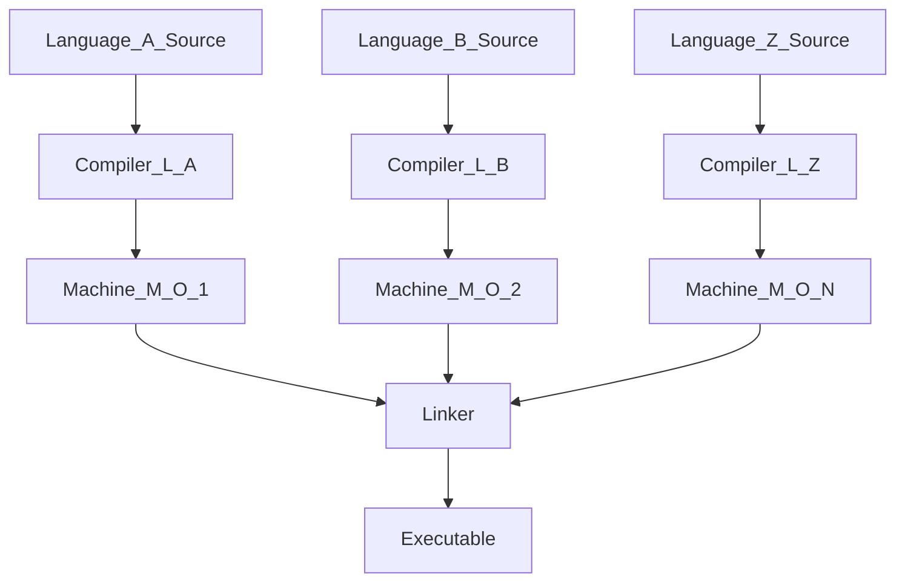
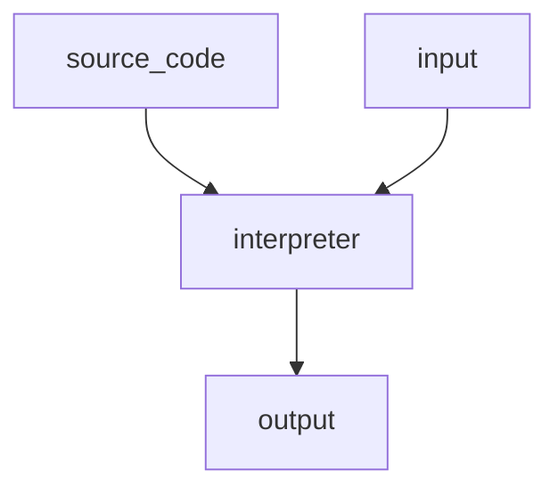
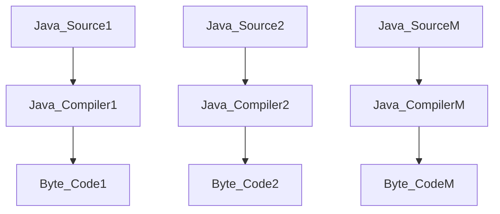
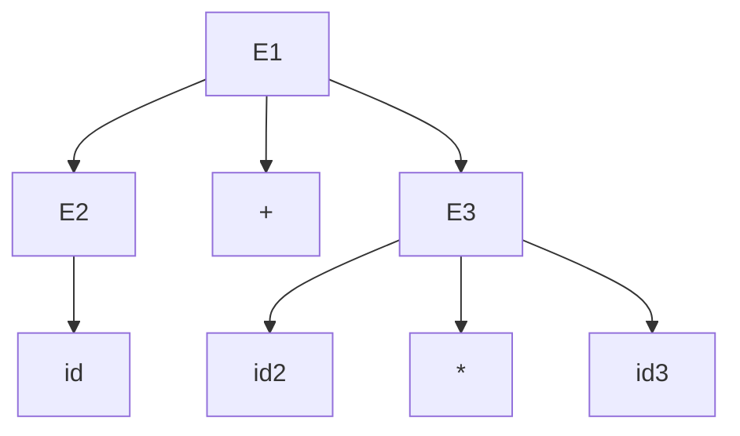

3/11/2022
-  Ints are typically 32 bits, and 2's complement
## Object-code to Executable

- Executable goes to process
- That diagram will be on exam
## Interpreter

- An interpreter is not translated to a language external to the interpreter code.
- REPL
	- Read execute Print Loop
## Hybrid

## Levels of abstraction
- Understand the ideas, not really any questions on this in th exam
## How do compilers work
- Know the major phases of a compiler
- Scanners(Token Stream) --> Parsers --> Semantic Analysis
###### Cross-Compiler
- When you generate code, you cross it over and generate it for another machine and put it on that other machine
- Sometimes done with mobile apps

- We're just gonna have to draw smaller diagrams not the huge ones (with like, 21 states)

## Ambiguity
- Should know ambiguity, phrase structured grammars, context-free, context-sensitive, regular
> Should have 2 or more left-most/right-most grammars
> Can also work with 2 ambiguous parse-trees
- Inherently ambiguous is one in which you cannot find an unambiguous

- Might be asked something about precendence rules in relation to the parse trees
- Might also be asked about associative rules and order of operations
- Could be asked what would be more appropriate in terms of a parse tree given a grammar ex:
> Associativity rules for Multiplication here
> E --> E * T | T
> T --> T + F | T
> F --> (E) | id
Should be able to show that this is better as a left-parse tree
## General
- Practice generating sentences with given grammars.
- Will have to come up with grammars
- Trace through a string and be able to udnerstand if it can be accepted by an FSA
- Be able to work with Regular expression.

